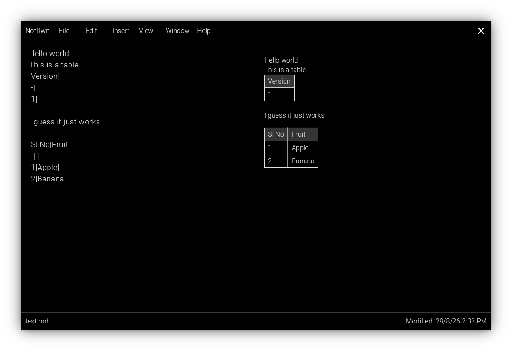
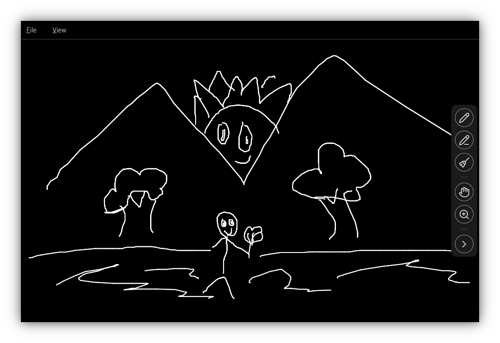

# NotDwn
Lightweight Flutter based office suite with markdown support.

## Screenshot

## Planned features
- [x] Textfile (.txt)
- [x] Markdown (.md) using `gpt_markdown` library
- [x] Drawing / Whiteboard
- [x] Tables using `pluto_grid` library
- [ ] CSV file support
- [ ] NotDwn language and support with embedded images
- [ ] Charts
- [ ] Knowledge graph
- [ ] Android editors
- [ ] User themes

# License
NotDwn - Lightweight office suite
Copyright (C) 2026 IcosagonZ

This program is free software: you can redistribute it and/or modify it under the terms of the GNU Affero General Public License as published by the Free Software Foundation, either version 3 of the License, or (at your option) any later version.

This program is distributed in the hope that it will be useful, but WITHOUT ANY WARRANTY; without even the implied warranty of MERCHANTABILITY or FITNESS FOR A PARTICULAR PURPOSE.  See the GNU Affero General Public License for more details.
