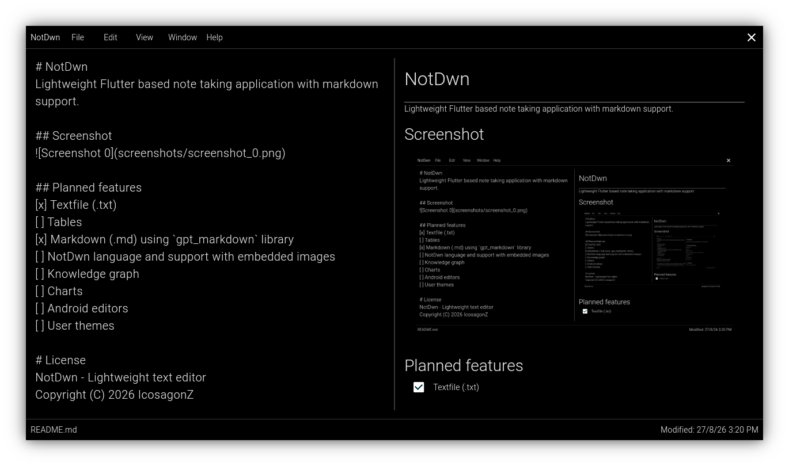

# NotDwn
Lightweight Flutter based text editor with markdown support.

## Screenshot

## Planned features
[x] Textfile (.txt)
[ ] Tables
[x] Markdown (.md) using `gpt_markdown` library
[ ] NotDwn language and support with embedded images
[ ] Knowledge graph
[ ] Charts
[ ] Android editors
[ ] User themes

# License
NotDwn - Lightweight text editor
Copyright (C) 2026 IcosagonZ

This program is free software: you can redistribute it and/or modify it under the terms of the GNU Affero General Public License as published by the Free Software Foundation, either version 3 of the License, or (at your option) any later version.

This program is distributed in the hope that it will be useful, but WITHOUT ANY WARRANTY; without even the implied warranty of MERCHANTABILITY or FITNESS FOR A PARTICULAR PURPOSE.  See the GNU Affero General Public License for more details.
